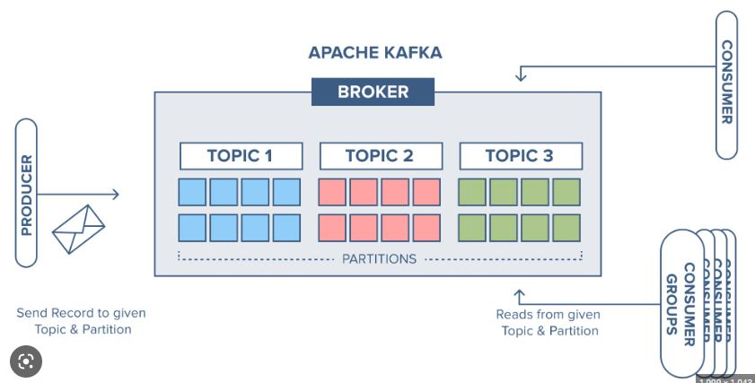
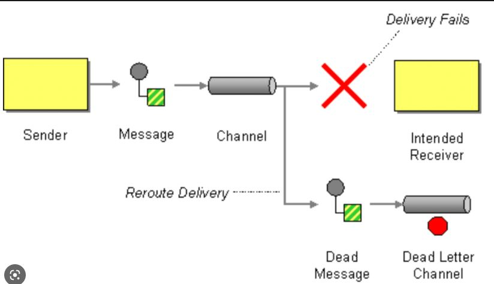

<h1> Project Springboot Kafka Example that can be send any object and listener with Dead-Letter </h1>  

<h2>Description English</h2>

 Project created as a reference to future projects where the Producer send an object and not necessary need to create each
factory to every kind of Object, and the kafka.infra is to build an image of Kafka.

 
<h2>Descrição português</h2>
Projeto criado como referência para futuros projetos onde o Produtor envia um objeto e não precisa necessariamente criar cada 
Factory para cada tipo de objeto, e o kafka.infra é para construir uma imagem de Kafka.

 

 
 

## Linkedin Below - Linkedin ABaixo

<h4 align="center">
   Created by   <a href="https://www.linkedin.com/in/luiz-carlos-b50693173/" target="_blank"> Luiz Carlos </a>
</h4>

</html>
